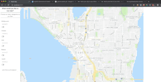
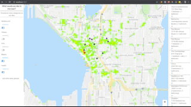

# Moving to Seattle

This project displays heatmaps of Seattle based on selected categories and then suggests currently available rental properties. You can toggle the different categories on or off. While a category is selected any locations contained said category will be displayed as a heatmap visualization layer over the map of Seattle. You can vary the intensity of the each heatmap category using the sliders.



When you press the "Where should I live?" button 10 suggested rental listings will appear. These are currently available rentals which are located in the densest regions based on the categories currently selected.



## Getting Started

If you want to run this application locally you'll first need to navigate over to the backend: https://github.com/CritJen/MovingToSeattle-BackEnd

### Setting Up The Frontend

- Install the neccessary dependencies

```
npm install
```

- Start your local server

```
npm start
```

You should see a message which says something is already running on port 3000. Select yes (y) to run the app on port 3001.

+Visit http://localhost:3001/ to intertact with the web app

### Built With

React- The web framework used
Npm - Dependency Management

### Authors

Jennifer Clark
